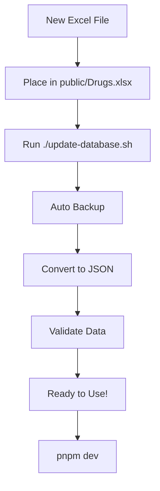

# MedSearch - UAE Pharmaceutical Database

A comprehensive React + TypeScript application for browsing, searching, and generating reports from the UAE pharmaceutical database.

## 📊 Features

- **Complete Database**: Browse 17,000+ medicine records from UAE pharmaceutical registry
- **Advanced Search**: Search by medicine name, generic name, or DOH drug code
- **Professional Reports**: Generate PDF reports with multiple filtering options
- **Medicine Details**: Detailed view with pricing, manufacturer, and coverage information
- **Responsive Design**: Works seamlessly on desktop and mobile devices
- **Excel Data Support**: Import data directly from Excel files

## 🚀 Quick Start

### Prerequisites

- Node.js (v18 or higher)
- pnpm (recommended) or npm

### Installation

```bash
# Clone the repository
git clone <repository-url>
cd my-react-ts-app

# Install dependencies
pnpm install

# Start development server
pnpm dev
```

## 📁 Data Management

The application supports both CSV and Excel data formats. The Excel format is preferred for the most comprehensive data.

### Current Data Source

The application uses `Drugs.xlsx` located in the `public/` directory, which contains:
- **17,354 medicine records**
- **Comprehensive pricing information** (public and pharmacy prices)
- **Manufacturer details**
- **Insurance plan information**
- **Status and regulatory data**

### How to Update Medicine Data

#### 🎯 Quick Update (Recommended)

The easiest way to update your database:

```bash
# 1. Place your new Excel file in public/ directory
cp /path/to/your/new/Drugs.xlsx public/

# 2. Run the automated update script
./update-database.sh
# OR
pnpm run update-data
```

The script will:
- ✅ Backup your current data
- ✅ Convert the Excel file to JSON
- ✅ Validate the conversion
- ✅ Show detailed statistics
- ✅ Clean up old backups

#### 🔄 Manual Methods

**Method 1: Standard Excel Conversion**
```bash
# Place your Excel file as public/Drugs.xlsx
pnpm run convert-excel
```

**Method 2: Auto-Detection (Works with any Excel file)**
```bash
# Place any Excel file in public/ directory
# Script will auto-detect columns and sheets
pnpm run convert-excel-auto
```

**Method 3: CSV Fallback (Legacy)**
```bash
# Place CSV as public/skus.csv
# Remove medicines.json to force CSV mode
rm public/medicines.json
pnpm dev
```

### Excel File Requirements

Your Excel file should have a sheet named **"Drugs"** with the following columns:

| Column Name | Description | Required |
|------------|-------------|----------|
| Drug Code | Unique identifier (e.g., "D98-2596-00001-01") | ✅ |
| Package Name | Brand/Trade name | ✅ |
| Generic Name | Generic drug name | ✅ |
| Strength | Drug strength/concentration | ✅ |
| Dosage Form | Form like "Tablets", "Cream", etc. | ✅ |
| Package Size | Size info (e.g., "50g", "40 Tablets") | ✅ |
| Package Price to Public | Public pricing | ✅ |
| Package Price to Pharmacy | Pharmacy pricing | ❌ |
| Unit Price to Public | Per unit public price | ❌ |
| Unit Price to Pharmacy | Per unit pharmacy price | ❌ |
| Manufacturer Name | Manufacturer information | ❌ |
| Status | "Active" or "Inactive" | ❌ |
| Insurance Plan | Insurance coverage info | ❌ |
| Agent Name | Distributor/Agent | ❌ |
| Greenrain Code | Alternative code system | ❌ |
| Generic Code | Generic identifier | ❌ |
| Dispense Mode | How it's dispensed | ❌ |
| Delete Effective Date | When deleted (if applicable) | ❌ |
| Last Change Date | Last modification date | ❌ |

### Automated Conversion Workflow

For frequent updates, you can create a simple workflow:

```bash
#!/bin/bash
# save as update-data.sh

echo "🔄 Updating medicine database..."

# Backup current data
cp public/medicines.json public/medicines.json.backup

# Convert new Excel data
pnpm run convert-excel

# Check if conversion was successful
if [ -f "public/medicines.json" ]; then
    echo "✅ Conversion successful!"
    echo "📊 Database updated with $(grep -c '^  {' public/medicines.json) records"
else
    echo "❌ Conversion failed, restoring backup"
    cp public/medicines.json.backup public/medicines.json
fi
```

Make it executable:
```bash
chmod +x update-data.sh
./update-data.sh
```

## 🛠️ Development Scripts

| Command | Description |
|---------|-------------|
| `pnpm dev` | Start development server |
| `pnpm build` | Build for production |
| `pnpm preview` | Preview production build |
| `pnpm lint` | Run ESLint |
| `pnpm convert-excel` | Convert Excel to JSON |
| `pnpm convert-csv` | Convert CSV to JSON (legacy) |

## 📋 Data Structure

The application processes Excel data into the following structure:

```typescript
interface Medicine {
  // Core fields
  id: string;                    // Drug Code
  name: string;                  // Package Name
  genericName: string;           // Generic Name
  strength: string;              // Strength
  dosageForm: string;            // Dosage Form
  packageSize: string;           // Package Size
  price: number;                 // Package Price to Public
  category: string;              // Auto-categorized (Oral, Topical, etc.)
  inStock: boolean;              // Derived from Status
  manufacturer: string;          // Manufacturer Name
  
  // Insurance/Coverage (auto-generated)
  uppScope: boolean;             // UPP coverage
  thiqa: boolean;                // Thiqa formulary
  basic: boolean;                // Basic formulary
  priorityScore: number;         // Calculated priority
  
  // Additional Excel fields
  drugCode: string;              // Drug Code
  greenrainCode?: string;        // Greenrain Code
  insurancePlan?: string;        // Insurance Plan
  packagePriceToPublic?: number; // Package Price to Public
  packagePriceToPharmacy?: number; // Package Price to Pharmacy
  // ... and more
}
```

## 🔧 Troubleshooting

### Common Issues

**1. Conversion Script Fails**
```bash
# Check if xlsx dependency is installed
pnpm list xlsx

# Reinstall if missing
pnpm add xlsx

# Try the auto-detection script
pnpm run convert-excel-auto
```

**2. Excel File Not Recognized**
```bash
# Analyze your Excel file structure
node scripts/analyzeExcel.cjs

# Check the analysis output
cat excel-analysis.txt

# Use auto-detection for non-standard files
pnpm run convert-excel-auto
```

**3. Empty or Invalid Data**
```bash
# Check if your Excel file has the right structure
node scripts/analyzeExcel.cjs

# Ensure the file has a "Drugs" sheet or similar
# Required columns: Drug Code, Package Name, Generic Name, etc.
```

**4. Application Shows Old Data**
```bash
# Force browser cache refresh
pnpm dev

# Or manually refresh with Ctrl+F5 in browser
# Check if medicines.json was updated: ls -la public/medicines.json
```

**5. Build Errors After Update**
```bash
# Check TypeScript errors
pnpm build

# Most common fix: restart dev server
pnpm dev
```

**6. Different Excel Format**

If your Excel file has different column names:

```bash
# Use the auto-detection script
pnpm run convert-excel-auto

# Or manually check what columns you have
node scripts/analyzeExcel.cjs
```

The auto-detection script can handle variations like:
- "Brand Name" vs "Package Name" vs "Product Name"
- "Drug Code" vs "ID" vs "Code"
- "Price" vs "Package Price to Public" vs "Retail Price"

### Excel File Validation

Before converting, ensure your Excel file meets these criteria:

✅ **File Format**: `.xlsx` or `.xls`  
✅ **Sheet Name**: Contains "drug", "medicine", or "data" (case-insensitive)  
✅ **Required Columns**: At minimum: ID/Code, Name, Generic Name, Price  
✅ **Data Rows**: At least 1 data row (excluding headers)  
✅ **File Size**: Reasonable size (< 50MB recommended)  

### Performance Considerations

- **Large files**: 17K+ records load in ~2-3 seconds
- **Memory usage**: ~12-15MB JSON file for 17K records
- **Search performance**: Client-side search handles 17K records smoothly
- **Build time**: ~30-60 seconds for TypeScript compilation

## 📱 Features Overview

### Database Page
- Browse all medicines with pagination (50 per page)
- Real-time search across all fields
- Professional data table with sorting
- Export to CSV functionality

### Medicine Details Modal
- Comprehensive drug information
- Pricing details (public & pharmacy)
- Insurance coverage status
- Manufacturer and agent information

### PDF Report Generation
- Multiple report types (All, UPP, Thiqa, Basic, etc.)
- Professional formatting with headers/footers
- "Yes/No" coverage indicators
- Customizable filtering options

## 🎨 UI/UX Features

- **Professional Design**: Modern, clean interface
- **Responsive Layout**: Works on all screen sizes
- **Compact Modals**: Optimized for single-screen viewing
- **Loading States**: Smooth loading experiences
- **Error Handling**: Graceful error management

## 📄 License

[Add your license information here]

## 🤝 Contributing

[Add contributing guidelines here]

## 📚 Quick Reference

### Essential Commands

| Command | Description |
|---------|-------------|
| `./update-database.sh` | 🎯 **One-click database update** |
| `pnpm dev` | Start development server |
| `pnpm build` | Build for production |
| `pnpm run validate-data` | Validate converted data |
| `pnpm run convert-excel-auto` | Auto-detect Excel format |

### File Structure

```
public/
├── Drugs.xlsx              # Your Excel data file
├── medicines.json           # Converted JSON (auto-generated)
├── medicines.json.backup.*  # Automatic backups
└── skus.csv                # Legacy CSV (optional)

scripts/
├── convertExcelToJson.cjs      # Standard Excel converter
├── convertExcelAdvanced.cjs    # Smart Excel converter
├── validateData.cjs            # Data validation
└── analyzeExcel.cjs           # Excel file analyzer

update-database.sh              # Automated update script
```

### Workflow Summary



### Data Flow

1. **Excel File** (`Drugs.xlsx`) → Contains raw pharmaceutical data
2. **Conversion Script** → Transforms Excel to optimized JSON format
3. **JSON File** (`medicines.json`) → Fast-loading format for the app
4. **React App** → Loads JSON and provides search/filtering
5. **PDF Reports** → Generated from filtered data

---

**🔄 Remember**: Run `./update-database.sh` whenever you update your Excel file!